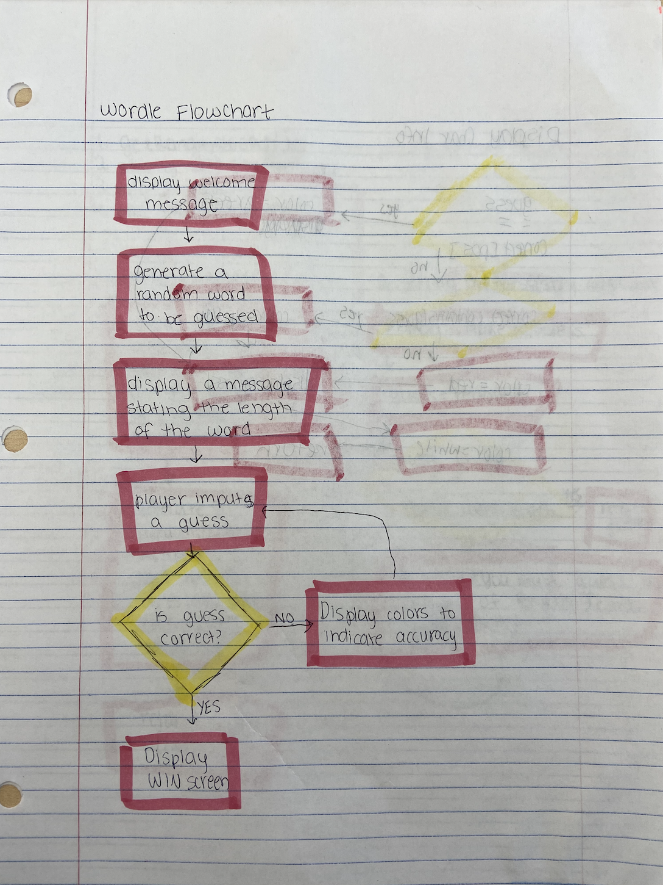
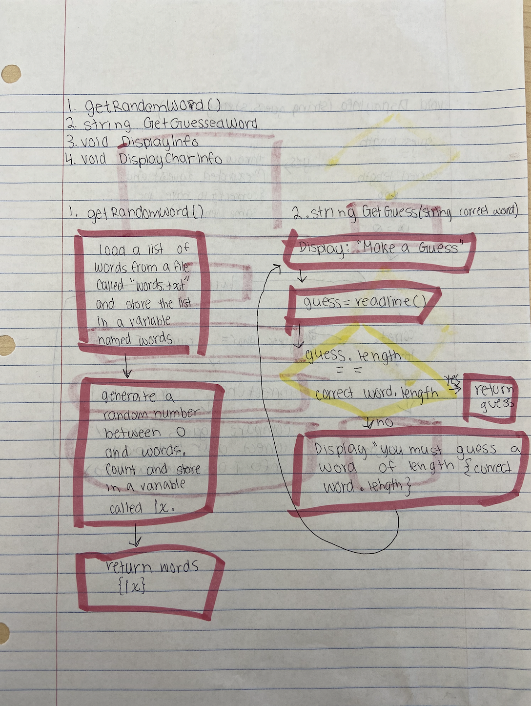
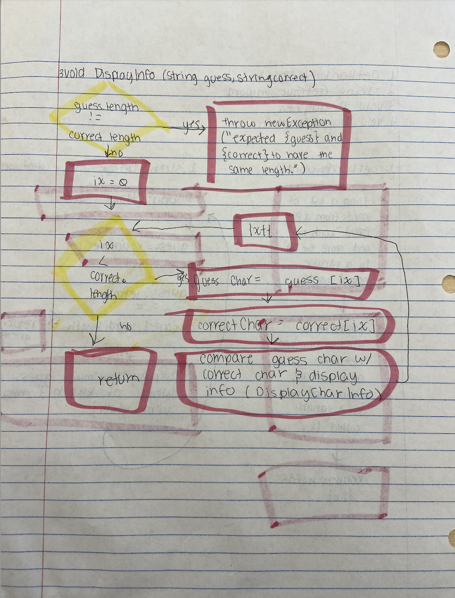
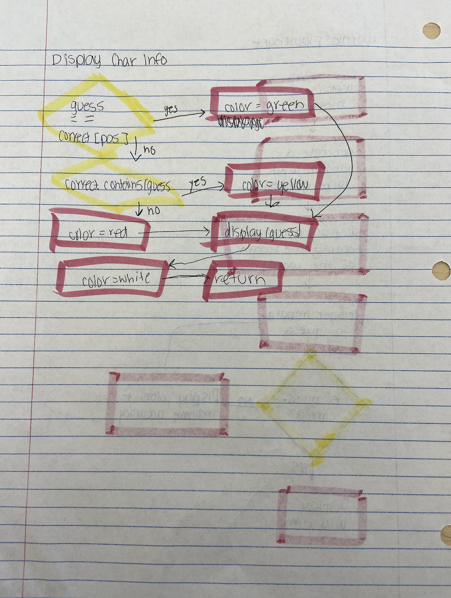

# ProjectProposal2

## Overview
The purpose of wordle is to entertain users by guessing different words. A random word will be generated and the number of letters in the word will be displayed to the user. The user then has to guess what the word. After each guess, a color will be displayed to tell the plyer how close they are to the word. Green will be displayed if the correct letter is in the correct place, yellow will be displayed if the letter is in the word, but not in the correct place, and grey if the letter is not in the word at all. They win when they guess the correct word exactly!

## High Level Design

- the player will be greeted with a welcome message
- a random word will be generated
- the number of letters in the word will be displayed
- the player will be prompted to guess a word with the correct amount of letters
- green will be displayed with the letter that is the correct letter in the correct spot
- yellow will be displayed with the letter if the letter is in the word, but not in the correct spot that they guessed
- this will repeat until the correct word is guessed
- when the word is guessed correctly, a winning message will be displayed

### Flowchart

## Methods
GetRandomWord(), string GetGuessedWord, void DisplayInfo, void DisplayCharInfo

### Flowcharts

